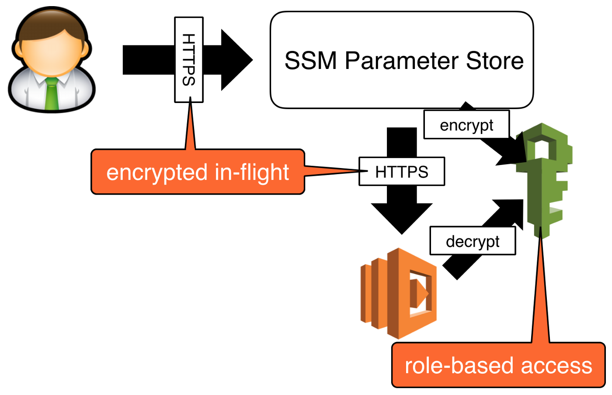
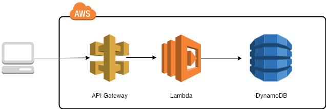

# AppClientes_ServerlessDynamoDB

* App para la gestión de clientes implementando NodeJs, Serverless V3, AWS CLI, SSM, Api Gateway, DynamoDB y Otras Tecnologías.


<br>

## Índice 📜

<details>
 <summary> Ver </summary>
 
 <br>
 
### Sección 1) Descripción, Tecnologías y Dependencias 

 - [1.0) Descripción del Proyecto.](#10-descripción-)
 - [1.1) Ejecución del Proyecto.](#11-ejecución-del-proyecto-)
 - [1.2) Tecnologías.](#12-tecnologías-)
 - [1.3) Plugins.](#13-plugins-)
 - [1.4) Extensiones VSC.](#14-extensiones-vsc-)
 
 
### Sección 2) Proyecto Serverless desde cero 
 
 - [2.0) Instalación y Configuración de Serverless Local](#20-instalación-y-configuración-de-serverless-local-)
 - [2.1) Configuración de Api Gateway](#21-configuración-de-api-gateway-) 
 - [2.2) Ejecución de Serverless Local](#22-ejecución-de-serverless-local-)
 - [2.3) SSM y IAM](#23-ssm-y-iam-)
      - [2.3.0) Arquitectura Lambda Function y SSM](#230-arquitectura-lambda-function-y-ssm)
      - [2.3.1) Instalación y Configuración de SSM Local](#231-instalación-y-configuración-de-ssm-local-)
 
 
 ### Sección 3) DynamoDB
 
 - [3.0) Arquitectura Lambda, Api Gateway y DynamoDB](#30-arquitectura-lambda-api-gateway-y-dynamodb-)
 - [3.1) Instalación y Configuración de DynamoDB Local](#31-instalación-y-configuración-de-dynamodb-local-)
 - [3.2) Ejecución de DynamoDB Local](#32-ejecución-de-dynamodb-local-)

<br>

</details>


<br>

## Sección 1) Descripción, Tecnologías y Dependencias 


### 1.0) Descripción [🔝](#índice-) 

<details>
  <summary>Ver</summary>
 
 <br>

* ipsum

<br>

</details>


### 1.1) Ejecución del Proyecto [🔝](#índice-)

<details>
  <summary>Ver</summary>
  
* Crear un entorno de trabajo a través de algún IDE
* Clonar el Proyecto (`git clone https://github.com/andresWeitzel/AppClientes_ServerlessDynamoDB`)
* Dentro del directorio instalar todos los plugins implementados
  * `npm install serverless-offline --save-dev`
  * `npm install -g serverless`
  * `pip install awscli` 
  * `npm install serverless-offline-ssm --save-dev`
  * `npm install serverless-dynamodb-local --save`
  * `serverless dynamodb install`
  * `serverless dynamodb start --migrate`
  * Reiniciar el IDE caso de tenerlo ejecutado. 
* Levantar Serverless en Local (`sls offline start`)
* Comprobar respuestas de los endpoints generados a través de alguna herramienta Cliente Http (Ej:Postman)

<br>

</details>


### 1.2) Tecnologías [🔝](#índice-)

<details>
  <summary>Ver</summary>
 
 <br>

### Tecnologías Implementadas

| **Tecnologías** | **Versión** | **Finalidad** |               
| ------------- | ------------- | ------------- |
| SDK | 4.3.2  | Inyección Automática de Módulas para Lambdas |
| Serverless Framework Core | 3.23.0 | Core Servicios AWS |
| Serverless Plugin | 6.2.2  | Librerías para la Definición Modular |
| AWS CLI | 1.27.8 | Interfaz de línea de comandos unificada para Amazon Web Servicios. |
| Systems Manager Parameter Store (SSM) | 3.0 | Manejo de Variables de Entorno |
| Amazon Api Gateway | 2.0 | Gestor, Autenticación, Control y Procesamiento de la Api | 
| DynamoDB | - | SGDB NoSQL | 
| NodeJS | 14.18.1  | Librería JS |
| VSC | 1.72.2  | IDE |
| Postman| 10.11  | Cliente Http |
| CMD | 10 | Símbolo del Sistema para linea de comandos | 
| Git | 2.29.1  | Control de Versiones |

<br>

</details>


### 1.3) Plugins [🔝](#índice-)

<details>
  <summary>Ver</summary>

| **Plugin** | **Descarga** |               
| -------------  | ------------- |
| serverless-offline |  https://www.serverless.com/plugins/serverless-offline |
| serverless-offline-ssm |  https://www.npmjs.com/package/serverless-offline-ssm |
| serverless-dynamodb-local |  https://www.npmjs.com/package/serverless-dynamodb-local |
| awscli | https://pypi.org/project/awscli/ |

<br>

</details>

### 1.4) Extensiones VSC [🔝](#índice-)

<details>
 <summary>Ver</summary>

| **Extensión** |              
| -------------  | 
| Prettier - Code formatter |
| YAML - Autoformatter .yml (alt+shift+f) |
| DotENV |


<br>

</details>


<br>

## Sección 2) Proyecto Serverless desde cero

### Arquitectura Lambda Function y Api gateway 

<details>
  <summary>Ver</summary>
 
 
 <br>
 


<br>

</details>


### 2.0) Instalación y Configuración de Serverless Local [🔝](#índice-)

<details>
 <summary>Ver</summary>
 
 <br>

* Una vez abierto el proyecto instalamos  serverless de forma Global `npm install -g serverless`
* Seguidamente creamos toda la config de serverless para nuestro proyecto(en mi caso el nombre del proyecto es `project-dynamodb`) `serverless create --template aws-nodejs --path project-dynamodb && cd project-dynamodb`
* Luego inicializamos el package.json en el proyecto `npm init -y`.
* Instalamos el plugin serverless-offline `npm i serverless-offline`
* Comprobamos versión `serverless --version`
* Salida Esperada ..

   ``` bash
    Framework Core: 3.23.0
    Plugin: 6.2.2
    SDK: 4.3.2

   ```
* Agregamos el plugin instalado de serverless-offline al archivo `serverless.yml`
* Configuramos los diversos parámetros necesarios del provider
* Creamos el directorio `src/lambdas/` y todas las funciones lambdas las trabajaremos dentro del mismo
* Cambiamos el nombre de nuestra lambda `handler.js` por `hello.js` y la llevamos al directorio de lambdas
* Nuestra lambda quedaría....
  ``` js
   'use strict';

   module.exports.test = async (event) => {
     return {
       statusCode: 200,
       body: JSON.stringify(
         {
           message: 'HI, LAMBDA ACTIVE',
           input: event,
         },
         null,
         2
       ),
     };

   };

  ```
* Configuramos tipo de método y path a través de httpApi para la lambda.
* Configuramos el puerto http 
* Archivo serveless.yml..

  ``` yml
  
   service: project-dynamodb

   frameworkVersion: '3'

   provider:
     name: aws
     runtime: nodejs14.x
     stage: dev
     region : us-west-1
     memorySize: 512
     timeout : 20

   plugins:
     - serverless-offline 

   custom: 
     serverless-offline:
       httpPort: 4000   

   functions:
     hello:
       handler: src/lambdas/hello.test
       events:
         - httpApi:
             method: GET
             path: hello

  ``` 
   
  
</br>   

* Guía Oficial : https://www.serverless.com//blog/serverless-framework-v3-is-live)   
* Guía Recomendada : https://medium.com/@patricio.aranguiz/serverless-offline-aws-lambda-api-gateway-15a4dfdfbc16
* Config Parámetros Provider : https://www.tutorialspoint.com/serverless/serverless_regions_memory_size_timeouts.htm


<br>
 
</details>


### 2.1) Configuración de Api Gateway [🔝](#índice-) 

<details>
 <summary>Ver</summary>
 
 <br>
 
 
 * API Gateway gestiona todas las tareas relacionadas con la aceptación y el procesamiento de centenares de miles de llamadas simultáneas a la API. Estas tareas incluyen la administración del tráfico, el control de la autorización y el acceso, el monitoreo y la administración de versiones de la API.
* No es necesario la instalación de ningún paquete adicional, este servicio viene incluido en la instalación principal de serverless.
* Para cada lambda es necesario adicionar el parametro `private: true` dentro de `- httpApi` para que se aplique la restricción de acceso correctamente.
* Vamos a generar una sección de `resources` . Esta es la plantilla de CloudFormation (Servicio de recursos de AWS) para declarar los recursos de serverless a utilizar.
* En este caso vamos a extender los diversos manejos de recursos para nuestra Api Gateway. (Tipos, Templates y Códigos de Respuesta).
* Para desacoplar código de nuestro serverless.yml para a generar un archivo .yml aparte para nuestro api gateway.
* Creamos dicho archivo dentro de la siguiente jerarquia dentro de nuestro proyecto `src/resources/api-gateway.yml`
* Nuestro `api-gateway.yml` quedaría..

  ``` yml
   Resources:
      ApiGatewayRestApi:
      Type: AWS::ApiGateway::RestApi
      Properties:
        Name: apiGatewayRestApi
      #### Gateway Response INIT
    GatewayResponseDefault400:
      Type: "AWS::ApiGateway::GatewayResponse"
      Properties:
        RestApiId:
          Ref: "ApiGatewayRestApi"
        ResponseType: DEFAULT_4XX
        ResponseTemplates:
          application/json: '{"error":{"code":"custom-4XX-generic","message":$context.error.messageString},"requestId":"$context.requestId"}'
    GatewayResponseDefault500:
      Type: "AWS::ApiGateway::GatewayResponse"
      Properties:
        RestApiId:
          Ref: "ApiGatewayRestApi"
        ResponseType: DEFAULT_5XX
        ResponseTemplates:
          application/json: '{"error":{"code":"custom-5XX-generic","message":$context.error.messageString},"requestId":"$context.requestId"}'
    GatewayResponseAccessDeied:
      Type: "AWS::ApiGateway::GatewayResponse"
      Properties:
        RestApiId:
          Ref: "ApiGatewayRestApi"
        ResponseType: ACCESS_DENIED
        ResponseTemplates:
          application/json: '{"error":{"code":"custom-403-access-denied","message":$context.error.messageString},"requestId":"$context.requestId"}'
    GatewayResponseApiConfigurationError:
      Type: "AWS::ApiGateway::GatewayResponse"
      Properties:
        RestApiId:
          Ref: "ApiGatewayRestApi"
        ResponseType: API_CONFIGURATION_ERROR
        ResponseTemplates:
          application/json: '{"error":{"code":"custom-500-api-configuration-error","message":$context.error.messageString},"requestId":"$context.requestId"}'
    GatewayResponseAuthorizerConfigurationError:
      Type: "AWS::ApiGateway::GatewayResponse"
      Properties:
        RestApiId:
          Ref: "ApiGatewayRestApi"
        ResponseType: AUTHORIZER_CONFIGURATION_ERROR
        ResponseTemplates:
          application/json: '{"error":{"code":"custom-500-authorizer-configuration-error","message":$context.error.messageString},"requestId":"$context.requestId"}'
    GatewayResponseAuthorizerFailure:
      Type: "AWS::ApiGateway::GatewayResponse"
      Properties:
        RestApiId:
          Ref: "ApiGatewayRestApi"
        ResponseType: AUTHORIZER_FAILURE
        ResponseTemplates:
          application/json: '{"error":{"code":"custom-500-authorizer-failure","message":$context.error.messageString},"requestId":"$context.requestId"}'
    GatewayResponseBadRequestBody:
      Type: "AWS::ApiGateway::GatewayResponse"
      Properties:
        RestApiId:
          Ref: "ApiGatewayRestApi"
        ResponseType: BAD_REQUEST_BODY
        ResponseTemplates:
          application/json: '{"error":{"code":"custom-400-bad-request-body","message":$context.error.messageString},"requestId":"$context.requestId"}'
    GatewayResponseBadRequestParameters:
      Type: "AWS::ApiGateway::GatewayResponse"
      Properties:
        RestApiId:
          Ref: "ApiGatewayRestApi"
        ResponseType: BAD_REQUEST_PARAMETERS
        ResponseTemplates:
          application/json: '{"error":{"code":"custom-400-bad-request-parameters","message":$context.error.messageString},"requestId":"$context.requestId"}'
    GatewayResponseExpiredToken:
      Type: "AWS::ApiGateway::GatewayResponse"
      Properties:
        RestApiId:
          Ref: "ApiGatewayRestApi"
        ResponseType: EXPIRED_TOKEN
        ResponseTemplates:
          application/json: '{"error":{"code":"custom-403-expired-token","message":$context.error.messageString},"requestId":"$context.requestId"}'
    GatewayResponseIntegrationFailure:
      Type: "AWS::ApiGateway::GatewayResponse"
      Properties:
        RestApiId:
          Ref: "ApiGatewayRestApi"
        ResponseType: INTEGRATION_FAILURE
        ResponseTemplates:
          application/json: '{"error":{"code":"custom-504-integration-failure","message":$context.error.messageString},"requestId":"$context.requestId"}'
    GatewayResponseIntegrationTimeout:
      Type: "AWS::ApiGateway::GatewayResponse"
      Properties:
        RestApiId:
          Ref: "ApiGatewayRestApi"
        ResponseType: INTEGRATION_TIMEOUT
        ResponseTemplates:
          application/json: '{"error":{"code":"custom-504-integration-timeout","message":$context.error.messageString},"requestId":"$context.requestId"}'
    GatewayResponseInvalidApiKey:
      Type: "AWS::ApiGateway::GatewayResponse"
      Properties:
        RestApiId:
          Ref: "ApiGatewayRestApi"
        ResponseType: INVALID_API_KEY
        ResponseTemplates:
          application/json: '{"error":{"code":"custom-403-invalid-api-key","message":$context.error.messageString},"requestId":"$context.requestId"}'
    GatewayResponseInvalidSignature:
      Type: "AWS::ApiGateway::GatewayResponse"
      Properties:
        RestApiId:
          Ref: "ApiGatewayRestApi"
        ResponseType: INVALID_SIGNATURE
        ResponseTemplates:
          application/json: '{"error":{"code":"custom-403-invalid-signature","message":$context.error.messageString},"requestId":"$context.requestId"}'
    GatewayResponseMissingAuthenticationToken:
      Type: "AWS::ApiGateway::GatewayResponse"
      Properties:
        RestApiId:
          Ref: "ApiGatewayRestApi"
        ResponseType: MISSING_AUTHENTICATION_TOKEN
        ResponseTemplates:
          application/json: '{"error":{"code":"custom-403-missing-authentication-token","message":$context.error.messageString},"requestId":"$context.requestId"}'
    GatewayResponseQuotaExceeded:
      Type: "AWS::ApiGateway::GatewayResponse"
      Properties:
        RestApiId:
          Ref: "ApiGatewayRestApi"
        ResponseType: QUOTA_EXCEEDED
        ResponseTemplates:
          application/json: '{"error":{"code":"custom-429-quota-exceeded","message":$context.error.messageString},"requestId":"$context.requestId"}'
    GatewayResponseRequestTooLarge:
      Type: "AWS::ApiGateway::GatewayResponse"
      Properties:
        RestApiId:
          Ref: "ApiGatewayRestApi"
        ResponseType: REQUEST_TOO_LARGE
        ResponseTemplates:
          application/json: '{"error":{"code":"custom-413-request-too-large","message":$context.error.messageString},"requestId":"$context.requestId"}'
    GatewayResponseResourceNotFound:
      Type: "AWS::ApiGateway::GatewayResponse"
      Properties:
        RestApiId:
          Ref: "ApiGatewayRestApi"
        ResponseType: RESOURCE_NOT_FOUND
        ResponseTemplates:
          application/json: '{"error":{"code":"custom-404-resource-not-found","message":$context.error.messageString},"requestId":"$context.requestId"}'
    GatewayResponseThrottled:
      Type: "AWS::ApiGateway::GatewayResponse"
      Properties:
        RestApiId:
          Ref: "ApiGatewayRestApi"
        ResponseType: THROTTLED
        ResponseTemplates:
          application/json: '{"error":{"code":"custom-429-throttled","message":$context.error.messageString},"requestId":"$context.requestId"}'
    GatewayResponseUnauthorized:
      Type: "AWS::ApiGateway::GatewayResponse"
      Properties:
        RestApiId:
          Ref: "ApiGatewayRestApi"
        ResponseType: UNAUTHORIZED
        ResponseTemplates:
          application/json: '{"error":{"code":"custom-401-unauthorized","message":$context.error.messageString},"requestId":"$context.requestId"}'
    GatewayResponseUnauthorizedMediType:
      Type: "AWS::ApiGateway::GatewayResponse"
      Properties:
        RestApiId:
          Ref: "ApiGatewayRestApi"
        ResponseType: UNSUPPORTED_MEDIA_TYPE
        ResponseTemplates:
          application/json: '{"error":{"code":"custom-415-unsupported-media-type","message":$context.error.messageString},"requestId":"$context.requestId"}'
      #### Gateway Response END

  ``` 
* Seguidamente referenciamos el archivo `api-gateway.yml` al `serverless.yml`
* La configuración General de nuestro `serverless.yml` quedaría...

     ``` yml
  
   service: project-dynamodb

   frameworkVersion: "3"

   provider:
     name: aws
     runtime: nodejs14.x
     stage: dev
     region : us-west-1
     memorySize: 512
     timeout : 10

   plugins:
     - serverless-offline

   custom:
     serverless-offline:
       httpPort: 4000

   functions:
     hello:
       handler: src/lambdas/hello.test
       events:
         - httpApi:
             method: GET
             path: hello
             private: true

   resources:
     - ${file(src/resources/api-gateway.yml)}

  ```

</br>   

* [Código Base de Ejemplo](https://gist.github.com/jonatassaraiva/4c33dd8225605c02318cd71a55b2335d)


<br>

</details>
 


### 2.2) Ejecución de Serverless Local [🔝](#índice-)

<details>
 <summary>Ver</summary>
 
 <br>


* Por defecto tenemos configurado una lambda llamada hello a través de su función .test que se ha modificado( por defecto serverless crea una lambda handler.js)
* Además tenemos configurada la seguridad y manejo de responses por parte de la Api Gateway, esta nos provera un token de acceso (x-api-key) para el acceso a cada lambda.
* Levantamos serverless con el comando `sls offline start` o `serverless offline start`
* Visualizamos el endpoint local que serverless nos genera..

     ``` bash
     Starting Offline at stage dev (us-east-1)

   Offline [http for lambda] listening on http://localhost:3002
   Function names exposed for local invocation by aws-sdk:
              * hello: project-dynamodb-dev-hello
   Remember to use 'x-api-key' on the request headers.
   Key with token: 'd41d8cd98f00b204e9800998ecf8427e'           
              
    GET | http://localhost:3000/hello   
    POST | http://localhost:3000/2015-03-31/functions/hello/invocations 
    
    Server ready: http://localhost:4000
  ``` 
* Abrimos alguna herramienta para generar peticiones http (ej: Postman) y generamos una request al endpoint generado junto con la api key de nuestro gateway  
* Seleccionamos método `GET`, luego escribimos el endpoint `http://localhost:3000/hello`, seguidamente pestaña `Headers` en `KEY` colocamos `x-api-key` y en `VALUE` colocamos el token generado `d41d8cd98f00b204e9800998ecf8427e`.
* Procedemos a ejecutar la request y podemos comprobar la metadata de la lambda en la consola de postman
* También obtenemos la respuesta por consola..
  
  ``` bash
    GET /hello (λ: hello)
   (λ: hello) RequestId: 63fc1719-ae56-4d56-8296-87d45b44fc96  Duration: 124.64 ms  Billed Duration: 125 ms
  ```
  
  
<br>

</details>
 


### 2.3) SSM e IAM [🔝](#índice-)

### 2.3.0) Arquitectura Lambda Function y SSM 

<details>
 <summary>Ver</summary>
 
<br>
 


<br>

</details>


### 2.3.1) Instalación y Configuración de SSM Local [🔝](#índice-)


<details>
 <summary>Ver</summary>
 
 <br>

* Instalamos el plugin `npm install serverless-offline serverless-offline-ssm --save-dev`
* Agregamos el complemento dentro del serverless.yml. Es importante mantener el orden siguiente (serverless-offline siempre último por temas de compatibilidad).
   
  ``` YML
    plugins:
       - serverless-offline-ssm
       - serverless-offline
  ``` 
* Dentro del proyecto creamos el archivo `serverless.env.yml` que será el que contenga los valores de las variables de entorno de nuestro proyecto
* Dentro de dicho archivo colocamos una variable test para comprobar su funcionamiento.. 
  
  ``` YML
    HELLO_TEST : ${ssm:/hello_test}  
  ```
* Relacionamos el arhivo `serverless.env.yml` dentro del `serverless.yml` agregando el parametro `enviroment` junto a dicho archivo..
 
  ``` YML
   provider:
     name: aws
     runtime: nodejs14.x
     stage: dev
     region : us-west-1
     memorySize: 512
     timeout : 10
     environment: ${file(serverless.env.yml)}  
  ``` 
* Seguidamente vamos a configurar el ssm dentro del bloque `custom` para el archivo `serverless.yml` 
* Agregamos el stage (IMPORTANTE RESPETAR EL STAGE DEL PROVIDER Y DEL SSM) y la variable test, quedando..

  ``` YML
    custom:
     serverless-offline-ssm:
       stages:
         - dev
       ssm:
         '/hello_test': 'HELLO SSM'
     serverless-offline:
       httpPort: 4000  
  ```
* Por último utilizamos dicha variable en la lambda declarada, para invocar una variable de entorno utilizamos `process.env.variable`  
 
    ```js
      'use strict';

      module.exports.test = async (event) => {
        return {
          statusCode: 200,
          body: JSON.stringify(
            {
              message: process.env.HELLO_TEST,
              input: event,
            },
            null,
            2
          ),
        };

      };

   ```
* Ejecutamos el programa, realizamos la petición get a través de postman a nuestra lambda y podemos visualizar la metadata de la misma junto con nuestra variable de entorno.
* Salida Esperada..

     ```cmd
        {
          "message": "HELLO SSM",
          "input": {
              "body": null,
              "cookies": [],
              "headers": {
                  "x-api-key": "d41d8cd98f00b204e9800998ecf8427e",
                  "content-type": "application/json",
                  "user-agent": "PostmanRuntime/7.29.2",
                  "accept": "*/*",
                  "cache-control": "no-cache",
                  "postman-token": "ea2e186f-732f-450e-abf2-4572b3e0206b",
                  "host": "localhost:4000",
                  "accept-encoding": "gzip, deflate, br",
                  "connection": "keep-alive",
                  "content-length": "163"
              },
              "isBase64Encoded": false,
              "pathParameters": null,
              "queryStringParameters": null,
              "rawPath": "/hello",
              "rawQueryString": "",
              "requestContext": {
                  "accountId": "offlineContext_accountId",
                  "apiId": "offlineContext_apiId",
                  "authorizer": {
                      "jwt": {}
                  },
                  "domainName": "offlineContext_domainName",
                  "domainPrefix": "offlineContext_domainPrefix",
                  "http": {
                      "method": "GET",
                      "path": "/hello",
                      "protocol": "HTTP/1.1",
                      "sourceIp": "127.0.0.1",
                      "userAgent": "PostmanRuntime/7.29.2"
                  },
                  "requestId": "offlineContext_resourceId",
                  "routeKey": "GET hello",
                  "stage": "$default",
                  "time": "31/Oct/2022:23:49:02 -0300",
                  "timeEpoch": 1667270942415
              },
              "routeKey": "GET hello",
              "stageVariables": null,
              "version": "2.0"
          }
      }
    ```
  
  <br>

</details>


<br>


## Sección 3) DynamoDB


### 3.0) Arquitectura Lambda, Api Gateway y DynamoDB [🔝](#índice-)

<details>
 <summary>Ver</summary>
 
 <br>
 
 
 
 <br>

</details>


### 3.1) Instalación y Configuración de DynamoDB Local [🔝](#índice-)

<details>
 <summary>Ver</summary>
 
 <br>

 * Dentro del directorio del proyecto ejecutamos `npm i serverless-dynamodb-local --save`
* Agregamos el plugin en el .yml

   ```yml
      plugins:
         - serverless-dynamodb-local
   ```

* Luego instalamos los complementos de dynamo `serverless dynamodb install`
* Dentro de `src/resources/` creamos el archivo `dynamo-table.yml`.
* Agregamos la config de la db (tablas, propiedades, etc) dentro de dicho .yml.
* Nuestro archivo `dynamo-table.yml` quedaría....
   
   ```yml
    Resources:
     usersTable:
       Type: AWS::DynamoDB::Table
       Properties:
         TableName: usersTable
         AttributeDefinitions:
           - AttributeName: year
             AttributeType: N
           - AttributeName: title
             AttributeType: S
         KeySchema:
           - AttributeName: year
             KeyType: HASH
           - AttributeName: title
             KeyType: RANGE
         ProvisionedThroughput:
           ReadCapacityUnits: 10
           WriteCapacityUnits: 10

   ```
* Agregamos dicho archivo al `serverless.yml` en la sección de resources..

  ```yml
   resources:
      - ${file(src/resources/api-gateway.yml)}
      - ${file(src/resources/dynamo-table.yml)}

  ```

* Verificamos que Dynamo haya sido configurado correctamente, ejecutamos dicho sgdb... `serverless dynamodb start --migrate`
* Salida esperada..

   ```cmd
    Dynamodb Local Started, Visit: http://localhost:8000/shell
    DynamoDB - created table usersTable
   
   ```

 <br>

</details>
  

### 3.2) Ejecución de DynamoDB Local [🔝](#índice-)

<details>
 <summary>Ver</summary>
 
 <br>

 * Para poder visualizar nuestro esquema de tablas y datos en local debemos utilizar `aws cli`.
* Instalamos dicho paquete `pip install awscli`
* Comprobamos la versión `aws --version`
* Salida Esperada...
 
  ```cmd
    aws-cli/1.27.8 Python/3.9.5 Windows/10 botocore/1.29.8
  ```
* Configuramos `credenciales ficticias`. DynamoDB offline no las validará, solo hay que proporcionarlas, no puede estar en blanco.
* `export AWS_ACCESS_KEY_ID=223344`
* `export AWS_SECRET_ACCESS_KEY=wJalrXUtTHISI/DYNAMODB/bPxRfiCYEXAMPLEKEY`
* Seguidamente en otra bash/terminal levantamos Dynamodb `serverless dynamodb start --migrate`
* Salida esperada..

   ```cmd
    Dynamodb Local Started, Visit: http://localhost:8000/shell
    DynamoDB - created table usersTable
   
   ```
* Regresando a la consola anterior levantamos aws cli con el endpoint que se nos ha generado (http://localhost:8000) y pasandole la región.
* Ejecutamos `aws dynamodb list-tables --endpoint-url http://localhost:8000 --region=us-east-1`
* Salida Esperada..
  
   ```cmd
       {
        "TableNames": [
            "usersTable"
        ]
    }
   
   ```
* `Hemos creado, configurado y ejecutado correctamente lo básico para poder trabajar con DynamoDB`

</br>

* https://dynobase.dev/run-dynamodb-locally/#serverless-framework
* https://docs.aws.amazon.com/apigateway/latest/developerguide/http-api-dynamo-db.html
* https://dynobase.dev/run-dynamodb-locally/#connecting-dynamodb-offline-cli

* CRUD DynamoDB : https://medium.com/dev-jam/serverless-simple-crud-application-in-10-minutes-on-aws-69e022298e80
* ÚLTIMA DOC IMPLEMENTADA CRUD DynamoDB : https://dev.to/rajandmr/dynamodb-crud-with-nodejs-and-lambda-inn

 
 
 <br>

</details>


